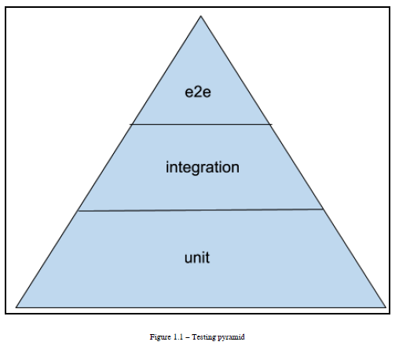
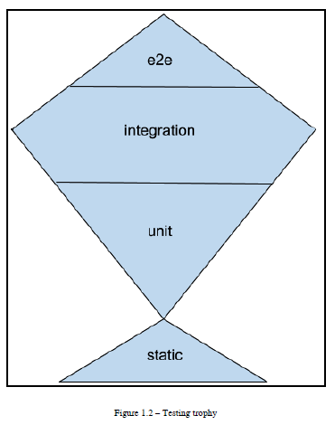

# Crafting Test-Driven Software with Python

## Section 1: Software Testing and Test-Driven Development

### 1. Getting Started with Software Testing
### 2. Test Double with a Chat Application
### 3. Test-Driven Development while Creating a TODO List
### 4. Scaling the Test Suite

## Section 2: PyTest for Python Testing

### 5. Introduction to PyTest
### 6. Dynamic and Parametric Tests and Fixtures
### 7. Fitness Function with a Contact Book Application
### 8. PyTest Essential Plugins
### 9. Managing Test Environments with Tox
### 10. Testing Documentation and Property-Based Testing

## Section 3: Testing for the Web

### 11. Testing for the Web: WSGI versus HTTP
### 12. End-to-End Testing with the Robot Framework

---
---

# Section 1: Software Testing and Test-Driven Development

---
---

# 1. Getting Started with Software Testing

## Introducing software testing and quality control

From the early days, it was clear that like any other machine, software needed a way to verify it was working properly and was built with no defects.

Software development processes have been heavily inspired by manufacturing industry standards, and early on, testing and quality control were introduced into the product development life cycle. So software companies frequently have a quality assurance team that focuses on setting up processes to guarantee robust software and track results.

Those processes usually include a quality control process where the quality of the built artifact is assessed before it can be considered ready for users.

The quality control process usually achieves such confidence through the execution of a test plan. This is usually a checklist that a dedicated team goes through during the various phases of production to ensure the software behaves as expected.

## Test plans

A test plan is composed of multiple test cases, each specifying the following:

* Preconditions: What's necessary to be able to verify the case
* Steps: Actions that have to succeed when executed in the specified order
* Postconditions: In which state the system is expected to be at the end of the steps

## Introducing automatic tests and test suites

Automated testing is, in practice, the art of writing another piece of software to test an original piece of software.

As testing a whole piece of software has to take millions of variables and possible code paths into account, a single program trying to test another one would be very complex and hard to maintain. For this reason, it's usually convenient to split that program into smaller isolated programs, each being a test case.

Each test case contains all the instructions that are required to set up the target software in a state where the parts that are the test case areas of interest can be tested, the tests can be done, and all the conditions can be verified and reset back to the state of the target software so a subsequent test case can find a known state from which to start.

## Introducing test-driven development and unit tests

Our tests in the previous section were all empty. The purpose was to showcase how a test suite can be made, executed, and organized in test cases and individual tests, but in the end, our tests did not test much.

Most individual tests are written following the "Arrange, Act, Assert" pattern:

* First, prepare any state you will need to perform the action you want to try.

* Then perform that action.

* Finally, verify the consequences of the action are those that you expected.

Generally speaking, in most cases, the action you are going to test is "calling a function," and for code that doesn't depend on any shared state, the state is usually all contained within the function arguments, so the Arrange phase might be omitted. Finally, the Assert phase will verify that the called function did what you expected, which usually means verifying the returned value and any effect at a distance that function might have.

## Test-driven development

Tests can do more than just validating our code is doing what we expect. The TDD process argues that tests are essential in designing code itself.

Writing tests before implementing the code itself forces us to reason about our requirements. We must explicitly express requirements in a strict, well-defined way – clearly enough that a computer itself (computers are known for not being very flexible in understanding things) can understand them and state whether the code you will be writing next satisfies those requirements.

## Test units

The immediate question once we know how to arrange our tests, is usually "what should I test?". The answer to that is usually "it depends."

You usually want tests that assert that the feature you are providing to your users does what you expect. But do tests do nothing to guarantee that, internally, the components that collaborate with that feature behave correctly? The exposed feature might be working as a very lucky side effect of 200 different bugs in the underlying components.

So it's generally a good idea to test those units individually and verify that they all work as expected.

What are those units? Well, the answer is "it depends" again.

In most cases, you could discuss that in procedural programming, the units are the individual functions, while in object-oriented programming, it might be defined as a single class. But classes, while we usually do our best to try to isolate them to a single responsibility, might cover multiple different behaviors based on which method you call. So they actually act as multiple components in our system, and in such cases, they should be considered as separate units.

In practice, a unit is the smallest testable entity that participates in your software.

## Understanding integration and functional tests

Testing all our software with solitary units can't guarantee that it's really working as expected. Unit testing confirms that the single components are working as expected, but doesn't give us any confidence about their effectiveness when paired together.

It's like testing an engine by itself, testing the wheels by themselves, testing the gears, and then expecting the car to work. We wouldn't be accounting for any issues introduced in the assembly process.

So we have a need to verify that those modules do work as expected when paired together.

That's exactly what integration tests are expected to do. They take the modules we tested individually and test them together.

## Integration tests

The scope of integration tests is blurry. They might integrate two modules, or they might integrate tens of them. While they are more effective when integrating fewer modules, it's also more expensive to move forward as an approach and most developers argue that the effort of testing all possible combinations of modules in isolation isn't usually worth the benefit.

The boundary between unit tests made of sociable units and integration tests is not easy to explain. It usually depends on the architecture of the software itself. We could consider sociable units tests those tests that test units together that are inside the same architectural components, while we could consider integration tests those tests that test different architectural components together.

## Functional tests

Integration tests can be very diverse. As you start integrating more and more components, you move toward a higher level of abstraction, and in the end, you move so far from the underlying components that people feel the need to distinguish those kinds of tests as they offer different benefits, complexities, and execution times.

That's why the naming of functional tests, end-to-end tests, system tests, acceptance tests, and so on all takes place.

Overall, those are all forms of integration tests; what changes are their goal and purpose:

* ***Functional*** tests tend to verify that we are exposing to our users the feature we actually intended. They don't care about intermediate results or side-effects; they just verify that the end result for the user is the one the specifications described, thus they are always black-box tests.

* ***End-to-End (E2E)*** tests are a specific kind of functional test that involves the vertical integration of components. The most common E2E tests are where technologies such as Selenium are involved in accessing a real application instance through a web browser.

* ***System tests*** are very similar to functional tests themselves, but instead of testing a single feature, they usually test a whole journey of the user across the system. So they usually simulate real usage patterns of the user to verify that the system as a whole behaves as expected.

* ***Acceptance tests*** are a kind of functional test that is meant to confirm that the implementation of the feature does behave as expected. They usually express the primary usage flow of the feature, leaving less common flows for other integration tests, and are frequently provided by the specifications themselves to help the developer confirm that they implemented what was expected.

But those are not the only kinds of integration that people refer to; new types are continuously defined in the effort to distinguish the goals of tests and responsibilities. Component tests, contract tests, and many others are kinds of tests whose goal is to verify integration between different pieces of the software at different layers. Overall, you shouldn't be ashamed of asking your colleagues what they mean exactly when they use those names, because you will notice each one of them will value different properties of those tests when classifying them into the different categories.

The general distinction to keep in mind when distinguishing between integration tests and functional tests is that unit and integration tests aim to test the implementation, while functional tests aim to test the behavior.

How you do that can easily involve the same exact technologies and it's just a matter of different goals. Properly covering the behavior of your software with the right kind of tests can be the difference between buggy software and reliable software. That's why there has been a long debate about how to structure test suites, leading to the testing pyramid and the testing trophy as the most widespread models of test distribution.

## Understanding the testing pyramid and trophy

Given the need to provide different kinds of tests – unit, integration, and E2E as each one of them has different benefits and costs, the next immediate question is how do we get the right balance?

Each kind of test comes with a benefit and a cost, so it's a matter of finding where we get the best return on investment:

* ***E2E tests*** verify the real experience of what the user faces. They are, in theory, the most realistic kind of tests and can detect problems such as incompatibilities with specific platforms (for example, browsers) and exercise our system as a whole. But when something goes wrong, it is hard to spot where the problem lies. They are very slow and tend to be flaky (failing for reasons unrelated to our software, such as network conditions).

* ***Integration tests*** usually provide a reasonable guarantee that the software is doing what it is expected to do and are fairly robust to internal implementation changes, requiring less frequent refactoring when the internals of the software change. But they can still get very slow if your system involves writes to database services, the rendering of page templates, routing HTTP requests, and generally slow parts. And when something goes wrong, we might have to go through tens of layers before being able to spot where the problem is.

* ***Unit tests*** can be very fast (especially when talking of solitary units) and provide very pinpointed information about where problems are. But they can't always guarantee that the software as a whole does what it's expected to do and can make changing implementation details expensive because a change to internals that don't impact the software behavior might require changing tens of unit tests.

Each of them has its own pros and cons, and the development community has long argued how to get the right balance.

The two primary models that have emerged are the testing pyramid and the testing trophy, named after their shapes.

## The testing pyramid

The testing pyramid originates from Mike Cohn's Succeeding with Agile book, where the two rules of thumb are "Write test with different granularities" (so you should have unit, integration, E2E, and so on...) and "the more you get high level, the less you should test" (so you should have tons of unit tests, and a few E2E tests).

While different people will argue about which different layers are contained within it, the testing pyramid can be simplified to look like this:

The tip of the pyramid is narrow, thus meaning we have fewer of those tests, while the base is wider, meaning we should mostly cover code with those kinds of tests. So, as we move down through the layers, the lower we get, the more tests we should have.

The idea is that as unit tests are fast to run and expose pinpointed issues early on, you should have a lot of them and shrink the number of tests as they move to higher layers and thus get slower and vaguer about what's broken.

The testing pyramid is probably the most widespread practice for organizing tests and usually pairs well with test-driven development as unit tests are the founding tool for the TDD process.

The other most widespread model is the testing trophy, which instead emphasizes integration tests.

## The testing trophy

The testing trophy originates from a phrase by Guillermo Rauch, the author of Socket.io and many other famous JavaScript-based technologies. Guillermo stated that developers should "Write tests. Not too many. Mostly integration."

Like Mike Cohn, he clearly states that tests are the foundation of any effective software development practice, but he argues that they have a diminishing return and thus it's important to find the sweet spot where you get the best return on the time spent writing tests.

That sweet spot is expected to live in integration tests because you usually need fewer of them to spot real problems, they are not too bound to implementation details, and they are still fast enough that you can afford to write a few of them.

So the testing trophy will look like this:

As you probably saw, the testing trophy puts a lot of value on static tests too, because the whole idea of the testing trophy is that what is really of value is the return on investment, and static checks are fairly cheap, up to the point that most development environments run them in real time. Linters, type checkers, and more advanced kinds of type analyzers are cheap enough that it would do no good to ignore them even if they are rarely able to spot bugs in your business logic.

Unit tests instead can cost developers time with the need to adapt them due to internal implementation detail changes that don't impact the final behavior of the software in any way, and thus the effort spent on them should be kept under control.

Those two models are the most common ways to distribute your tests, but more best practices are involved when thinking of testing distribution and coverage.

## Testing distribution and coverage

While the importance of testing is widely recognized, there is also general agreement that test suites have a diminishing return.

There is little point in wasting hours on testing plain getters and setters or testing internal/private methods. The sweet spot is said to be around 80% of code coverage, even though I think that really depends on the language in use – the more expressive your language is, the less code you have to write to perform complex actions. And all complex actions should be properly tested, so in the case of Python, the sweet spots probably lies more in the range of 90%. But there are cases, such as porting projects from Python 2 to Python 3, where code coverage of 100% is the only way you can confirm that you haven't changed any behavior at all in the process of porting your code base.

Last but not least, most testing practices related to test-driven development take care of the testing practice up to the release point. It's important to keep in mind that when the software is released, the testing process hasn't finished.

Many teams forget to set up proper system tests and don't have a way to identify and reproduce issues that can only happen in production environments with real concurrent users and large amounts of data. Having staging environments and a suite to simulate incidents or real users' behaviors might be the only way to spot bugs that only happen after days of continuous use of the system. And some companies go as far as testing the production system with tools that inject real problems continuously for the sole purpose of verifying that the system is solid.

# 2. Test Double with a Chat Application

## Introducing test doubles

In test-driven development, the tests drive the development process and architecture. The software design evolves as the software changes during the development of new tests, and the architecture you end up with should be a consequence of the need to satisfy your tests.

Tests are thus the arbiter that decides the future of our software and declares that the software is doing what it is designed for. There are specific kinds of tests that are explicitly designed to tell us that the software is doing what it was requested: Acceptance and Functional tests.

So, while there are two possible approaches to TDD, top-down and bottom-up (one starting with higher-level tests first, and the other starting with unit tests first), the best way to avoid going in the wrong direction is to always keep in mind your acceptance rules, and the most effective way to do so is to write them down as tests.

But how can we write a test that depends on the whole software existing and working if we haven't yet written the software at all? The key is test doubles: objects that are able to replace missing, incomplete, or expensive parts of our code just for the purpose of testing.

A test double is an object that takes the place of another object, faking that it is actually able to do the same things as the other object, while in reality, it does nothing.

But if we make our tests pass with test doubles, how do we avoid shipping software that is just a bunch of fake entities? That's why it's important to have various layers of tests – the more you move up through the layers, the fewer test doubles you should have, all the way up to end-to-end tests, which should involve no test doubles at all.

Test-driven development also suggests that we should write the minimum amount of code necessary to make a test pass and it's a very important rule because, otherwise, you could easily end up writing code whose development has to be driven by other new tests.

That means that to have a fairly high-level test (such as an acceptance test) pass, we are probably going to involve many test doubles at the beginning (as our software is still empty). So when are we expected to replace those test doubles with real objects?

That's where Test-Driven Development by Example by Kent Beck suggests relying on a TODO list. As you write your code, you should write down anything that you think you need to improve/support/replace. And before moving forward to writing the next acceptance test, the TODO list should be completed.

In your TODO list, you can record entries to replace the test doubles with real objects. As a consequence, we are going to write tests that verify the behaviors of those real objects and, subsequently, their implementation, finally replacing them with the real objects themselves in our original acceptance test to confirm it still passes.

To showcase how test doubles can help us during TDD, we are going to build a chat application by relying on the most common kind of test doubles.

# 3. Test-Driven Development while Creating a TODO List

\-

# 4. Scaling the Test Suite

## Working with multiple suites

The separation of tests we did earlier in this chapter helped us realize that there can be multiple test suites inside our tests directory.

We can then point the unittest module to some specific directories using the -k option to run test units on every change, and functional tests when we think we have something that starts looking like a full feature. Thus, we will rely on e2e tests only when making new releases or merging pull requests to pass the last checkpoint.

There are a few kinds of test suites that are usually convenient to have in all our projects. The most common kinds of tests suites you will encounter in projects are likely the compile suite, commit tests, and smoke tests.

### Compile suite

The compile suite is a set of tests that must run very fast. Historically, they were performed every time the code had to be recompiled. As that was a frequent action, the compile suite had to be very fast. They were usually static code analysis checks, and while Python doesn't have a proper compilation phase, it's still a good idea to have a compile suite that we can maybe run every time we modify a file.

### Commit tests

As the name suggests, commit tests are tests you run every time you commit a new change.

### Smoke tests

Smoke tests are a set of tests used to identify whether we broke the system in an obvious way and thus let us know that it doesn't make sense to proceed with further testing.

Historically, it came from a time where test cases were manually verified, so before investing hours of human effort, a set of checks was performed to ensure that the system did work and thus it made sense to test it.

Nowadays, tests are far faster and cheaper as they are performed by machines, but it still makes sense to have a smoke test suite before running the more expensive tests. It's usually a good idea to select a subset of your e2e tests that constitute the smoke test suite, and run the complete e2e suite only if it passed the smoke tests.

Sometimes, smoke tests are a dedicated set of tests explicitly written for that purpose, but an alternative is to select a set of other tests that we know exercise the most meaningful parts of our system and "tag" them as smoke tests

---
---

# Section 2: PyTest for Python Testing

---
---

# 5. Introduction to PyTest

\-

# 6. Dynamic and Parametric Tests and Fixtures

\-

# 7. Fitness Function with a Contact Book Application

\-

# 8. PyTest Essential Plugins

\-

# 9. Managing Test Environments with Tox

\-

# 10. Testing Documentation and Property-Based Testing

\-